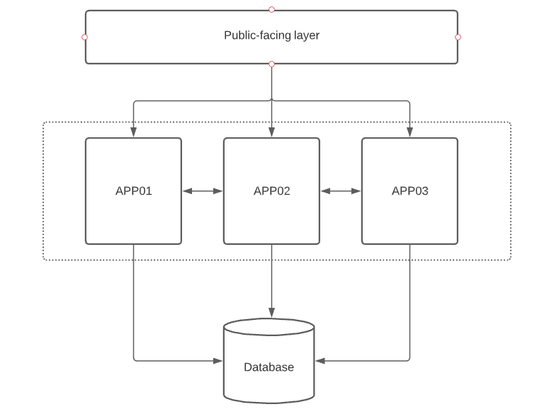
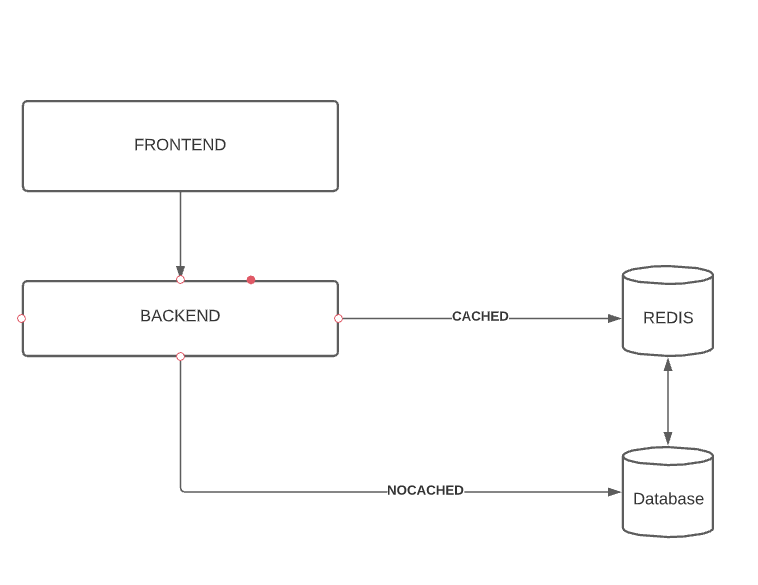

## 
# How would you setup your Infrastructure?

There are such many ways to setup a solid infrastructure, starting from having a microservice environment, with an 
orchestration on top of it, and have some replica and policy in order to scale-up/down the app based on load or requests.

Also, an application balancer might help to split the load across the multi application.

Or having a typical environment based with stand-alone VMs, maybe part of an auto-scaling group if we use a Cloud provider,
and having on top of it a proxy (NGINX,HaProxy), and an APP gatewy as well.

The import thing to keep in mind is to have always a three layer of failures, in order to reduce the business impact.




### Introduce REDIS Cache





## How would you setup your infrastructure monitoring?
First question is, are we allowed to spend money? 

There are a few good OpenSource solution that might help the business to get some valid metrics, in order to collect metrics
we can use tools such as Prometheus,Nagios,OP5,Graphite and then in order to visualite we can use Grafana or Kibana.
Be aware these tools are completely free and opensource.

As enterprise, we can adopt DataDog,NewRelic or PRTG.

All the tools need an agent, and this agent can be customized in order to collect data, the benefit of this is that based 
on the role we can demand a specific metric/metrics and visualize the output on the graph.


## How would you setup your log monitoring?

No doubt, ELK and beat.

We have many beats, and each of them has a specific role:
    - Filebeat , log collector, can read any .log and also parse json file
    - Metricbeat, read metrics such as CPU,ram etc.. this one can be used as monitoring solution as well
    - Auditbet, audit and security access

## How would you setup up your CI/CD workflow?

As we know we have many CI/CD tools, most of them are enterprise.
I prefer Jenkins, it has a lot of integration with many engines, it can be autoscale, and it is very light, it can be execute
into a docker with persistent volume.

Using Jenkins as example, the pipeline that be part of the repository, like so the developer has fully vision of how the app will be deployed
and where. Each commit will trigger a build thanks to the webhooks integration.


## How would you handle scaling?

Pretty much related to the first question, when we know how the infrastrucure will be configured than we can adopt an autoscaling.
The Best way is to always use an orchestration or third part solution that does that.
it might be K8s or Nomad (if we have microservice) or  Consul (powerfull app balancer).

## How would you handle the setup for new clients?

Wrap everything into a configuration managment, that it might be ansible and create template jinja based, it will help 
to save time and have less code.
Also it can be reused as many times you want, and when you need to do change/changes or update, you have to change it 
only in one place.
The pick up of the solution it depends if we are CLoud oriented or not, wit Cloud we have many integration, 
one of the example to use is the benefit of having terraform.


# EXTRA contents

GitHub project: https://github.com/cabrizio/devops-abc

## How to use it 

I have created two small app, one is the frontend page and the second is a backend.
What they do is basically collect metrics from the instance and display on the frontend page.
In order to make our life easier I have created a Dockerfile in order to build the image for the container, and a Makefile 
that simplify the process.
Makefile needs to be used as:
 - make docker-build (in order to build our docker image)
 - make docker-run (to run the container on port 5000/default)
 - make docker-tag (if needed we can tag the img as v1.0)
 - make docker-stop (it stops the container named backend/frontend)

Also I have created a third app to demonstrate the integration with redis cache, and an external resource using mysql,
and exposing an api.
To execute the app it will be enough to type ```npm init``` then ```npm install --save axios express redis``` 
and ```node app.js```.

The DEV env could have some mistake, and could be improved, unfortunately did not have much time to deliver something 
perfect to be released in prod.


